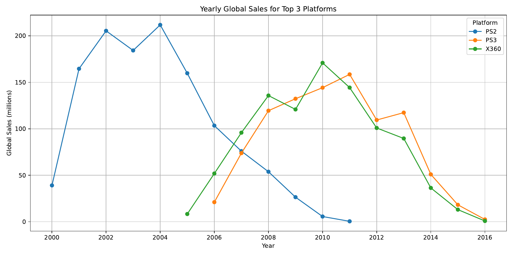
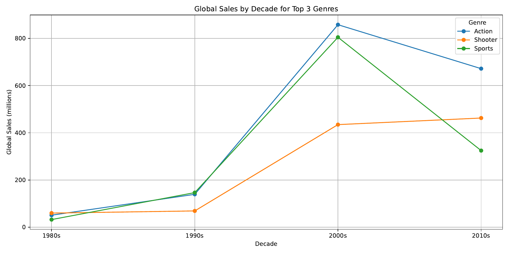
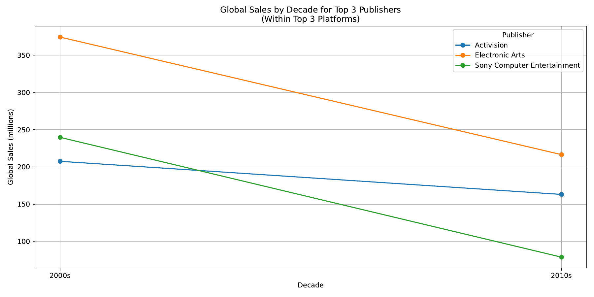

# Video Game Sales — MapReduce Analytics Pipeline

A multi-stage MapReduce pipeline that cleans, aggregates, and analyzes a 16,000+ record video
game sales dataset, built with `mrjob` and MongoDB. The pipeline answers three progressively
harder analytical questions using chained MapReduce jobs rather than pandas/SQL shortcuts,
each backed by its own visualization.

## Dataset

[`data/VideoGameSales.csv`](data/VideoGameSales.csv) — 16,598 video game sales records, each
with genre, platform, publisher, release year, and global sales (in millions of units).

## Pipeline overview

**Stage 1 — Extract & clean (`src/task1_1.py`)**
Raw CSV records are loaded into MongoDB, then filtered to remove rows with missing or invalid
genre, platform, publisher, year, or sales fields. Of the 16,598 raw records, **16,191 passed
validation** (a ~2.5% drop rate) and were written to a tab-delimited file and a `game_extracted`
MongoDB collection, which becomes the input for every MapReduce job downstream.

**Stage 2 — Total sales by genre (`src/task1_2.py`)**
A single mapper/reducer MapReduce job aggregating total global sales per genre.

**Stage 3 — Three analytical pipelines, each built from chained MapReduce jobs:**

| Question | Approach | Result |
|---|---|---|
| Top-selling platforms, sales by year | 2-stage MapReduce: (1) sum sales per platform → select top 3, (2) filter to those 3 platforms → sum per platform-year → sort chronologically | **PS2** (1,230.7M), **X360** (968.7M), **PS3** (948.0M) |
| Top-selling genres, sales by decade | 2-stage MapReduce: (1) sum sales per genre → select top 3, (2) filter to those genres → bucket by decade → sort chronologically | **Action** (1,719.9M), **Sports** (1,308.1M), **Shooter** (1,025.9M) |
| Top publishers *within* the top platforms, by decade | 3-stage chained MapReduce: (1) find top 3 platforms, (2) filter to those platforms → find top 3 publishers within them, (3) filter to both → bucket by decade | **Electronic Arts**, **Activision**, **Sony Computer Entertainment** |

Each stage's output feeds the next stage's filter — the top-3 platform/genre/publisher lists
produced by one MapReduce job are read back in as a filter condition for the next, rather than
solving everything in one pass.

## Results

**Top 3 platforms by yearly global sales**


**Top 3 genres by decade**


**Top 3 publishers within the top 3 platforms, by decade**


## Tech stack

- **Python** — `mrjob` for MapReduce, `pymongo` for MongoDB access, `matplotlib` for visualization
- **MongoDB** — staging store for raw and cleaned records
- **MapReduce** — every aggregation step (sums, top-N selection, sorting) is implemented as an
  explicit map/reduce job rather than an in-memory pandas operation

## Repository structure

```
├── data/
│   └── VideoGameSales.csv          # source dataset
├── src/
│   ├── task1_1.py                  # extract + clean → MongoDB + text file
│   ├── task1_2.py                  # MapReduce: total sales by genre
│   ├── task2_1_step1.py            # MapReduce: total sales by platform → top 3
│   ├── task2_1_step2.py            # MapReduce: yearly sales for top 3 platforms
│   ├── task2_1_viz.py              # chart: platform trend
│   ├── task2_2_step1.py            # MapReduce: total sales by genre → top 3
│   ├── task2_2_step2.py            # MapReduce: decade sales for top 3 genres
│   ├── task2_2_viz.py              # chart: genre trend
│   ├── task2_3_step1.py            # MapReduce: total sales by platform → top 3
│   ├── task2_3_step2.py            # MapReduce: total sales by publisher (within top platforms) → top 3
│   ├── task2_3_step3.py            # MapReduce: decade sales for top publishers within top platforms
│   └── task2_3_viz.py              # chart: publisher trend
└── outputs/                        # generated text outputs, chart PNGs and PDFs
```

## Running it

Requires MongoDB running locally and the `mrjob` and `pymongo` packages installed.

```bash
pip install mrjob pymongo matplotlib

# Stage 1: extract and clean into MongoDB + task1_1_output.txt
python src/task1_1.py

# Stage 2: total sales by genre
python src/task1_2.py outputs/task1_1_output.txt > outputs/task1_2_output.txt

# Stage 3a: top platforms, then yearly sales for those platforms
python src/task2_1_step1.py outputs/task1_1_output.txt > outputs/task2_1_step1_output.txt
python src/task2_1_step2.py outputs/task1_1_output.txt > outputs/task2_1_step2_output.txt
python src/task2_1_viz.py

# Stage 3b: top genres, then decade sales for those genres
python src/task2_2_step1.py outputs/task1_1_output.txt > outputs/task2_2_step1_output.txt
python src/task2_2_step2.py outputs/task1_1_output.txt > outputs/task2_2_step2_output.txt
python src/task2_2_viz.py

# Stage 3c: top platforms → top publishers within them → decade sales
python src/task2_3_step1.py outputs/task1_1_output.txt > outputs/task2_3_step1_output.txt
python src/task2_3_step2.py outputs/task1_1_output.txt > outputs/task2_3_step2_output.txt
python src/task2_3_step3.py outputs/task1_1_output.txt > outputs/task2_3_step3_output.txt
python src/task2_3_viz.py
```

## Background

Originally built as a MapReduce/Big Data coursework project, then restructured here as a
standalone pipeline with cleaned outputs and documentation.
